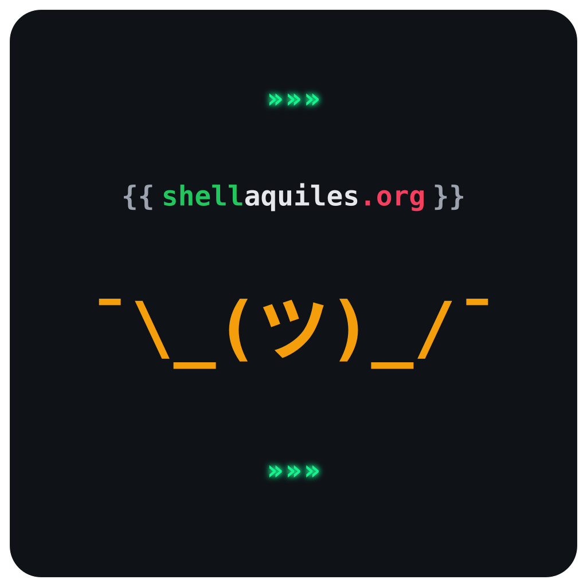

<p align="center">
  
</p>

<h1 align="center">{{ shellaquiles.org }}</h1>

<p align="center">
  <strong>Software libre e infraestructura comunitaria en México.</strong><br>
  Construimos herramientas públicas, mantenemos pipelines de datos<br>
  y colaboramos en código de producción. Menos burocracia, más ejecución.
</p>

<p align="center">
  <a href="https://shellaquiles.org">Sitio</a> ·
  <a href="https://shellaquiles.org/proyectos.html">Catálogo</a> ·
  <a href="https://shellaquiles.org/blog/manifiesto">Manifiesto</a> ·
  <a href="https://t.me/shellaquiles">Telegram</a>
</p>

---

## Quiénes somos

**Shellaquiles** une la precisión de la terminal (*Shell*) con el contexto técnico de México (*Chilaquiles*).

No somos una academia ni un foro de discusión. Somos un **laboratorio de ejecución técnica**: proyectos con usuarios reales, pruebas, CI y código auditable. Coordinado por [@pixelead0](https://github.com/pixelead0).

## Qué hacemos

| Eje | Enfoque |
| :--- | :--- |
| **Infraestructura pública** | Herramientas de uso libre: calendarios, APIs, pipelines y datos abiertos para la comunidad tech en México. |
| **Transferencia técnica** | Talleres y rutas prácticas de Python, backend, Linux y arquitectura — sin credencialismo. |
| **Bits de conocimiento** | Charlas relámpago de 10 minutos para documentar incidencias reales y prácticas de ingeniería. |

* `// EJECUCIÓN` — Las ideas valen cuando están en producción.
* `// RIGOR` — El software abierto se trata con el mismo estándar que un sistema crítico.
* `// ACCESO` — El conocimiento se transfiere en horizontal: PRs, revisiones y sesiones prácticas.

## Proyectos públicos

Catálogo vivo también en [shellaquiles.org/proyectos](https://shellaquiles.org/proyectos.html).

| Proyecto | Qué es | Enlaces |
| :--- | :--- | :--- |
| **[cron-quiles](https://github.com/shellaquiles/cron-quiles)** | Agregador unificado de eventos tech en México (Meetup, Luma, ICS). Feeds iCal, WebCal y JSON. | [App](https://shellaquiles.github.io/cron-quiles/) · [Detalle](https://shellaquiles.org/blog/cronquiles-el-agregador-de-la-comunidad) |
| **[tribuTACOS](https://github.com/shellaquiles/tribuTACOS)** | Inteligencia fiscal, conciliación de CFDI 3.3/4.0 y pre-declaración mensual/anual ante el SAT. | [Detalle](https://shellaquiles.org/blog/tributacos-plataforma-de-inteligencia-fiscal-y-predeclarador-sat) |
| **[stats](https://github.com/shellaquiles/stats)** | Dashboard de telemetría de repositorios: stars, clones y visitas más allá de los 14 días de GitHub. | [App](https://shellaquiles.github.io/stats/) · [Detalle](https://shellaquiles.org/blog/stats-dashboard-de-telemetria-web-y-huella-digital-de-repositorios) |
| **[frases-chingonas](https://github.com/shellaquiles/frases-chingonas)** | Catálogo interactivo de axiomas de ingeniería y lecciones de arquitectura de software. | [App](https://shellaquiles.github.io/frases-chingonas/) · [Detalle](https://shellaquiles.org/blog/frases-chingonas-sabiduria-tecnica-en-capsulas) |
| **[hit-tazos-tech](https://github.com/shellaquiles/hit-tazos-tech)** | Juego de cartas y trivia cronológica técnica (576 cartas en 8 volúmenes). Print & Play libre y Web 3D interactiva. | [App](https://shellaquiles.github.io/hit-tazos-tech/) · [Detalle](https://shellaquiles.org/blog/hit-tazos-tech-trivia-cronologica-para-programadores) |
| **[KARNITAS](https://github.com/shellaquiles/KARNITAS)** | Estándar abierto `.agents/` para contexto, memoria y gobernanza de agentes de IA en Git. | [Detalle](https://shellaquiles.org/blog/karnitas-estandar-abierto-de-gobernanza-y-contexto-para-agentes-de-ia) |
| **[pandocquiles](https://github.com/shellaquiles/pandocquiles)** | Conversión de documentación Markdown a PDF/HTML con estilos técnicos y publicación a Drive. | [Detalle](https://shellaquiles.org/blog/pandocquiles-motor-automatico-de-conversion-y-publicacion-de-documentacion) |
| **[shellaquiles-org](https://github.com/shellaquiles/shellaquiles-org)** | Sitio, blog y manifiesto del ecosistema. | [shellaquiles.org](https://shellaquiles.org) |

Curso asociado (vive fuera de esta org): **[Pyquiles al Pastor](https://github.com/pixelead0/pyquiles-al-pastor)** — ruta abierta de Python moderno. [Curso](https://pixelead0.github.io/pyquiles-al-pastor/) · [Detalle](https://shellaquiles.org/blog/pyquiles-al-pastor-el-curso-de-python-con-sabor-mexicano)

## Cómo participar

No hace falta pedir permiso para empezar.

1. Entra al grupo de [Telegram](https://t.me/shellaquiles).
2. Elige un repo, busca issues `help wanted` o `good first issue`, y abre un Pull Request.
3. Si quieres proponer un taller, una integración o infraestructura: [participar@shellaquiles.org](mailto:participar@shellaquiles.org).

```bash
git clone https://github.com/shellaquiles/shellaquiles-org.git
git clone https://github.com/shellaquiles/cron-quiles.git
```

**Contacto:** [shellaquiles.org](https://shellaquiles.org) · [Telegram](https://t.me/shellaquiles) · [participar@shellaquiles.org](mailto:participar@shellaquiles.org)
